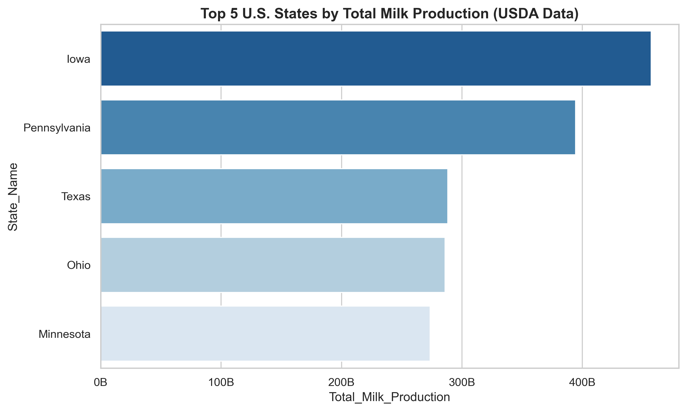
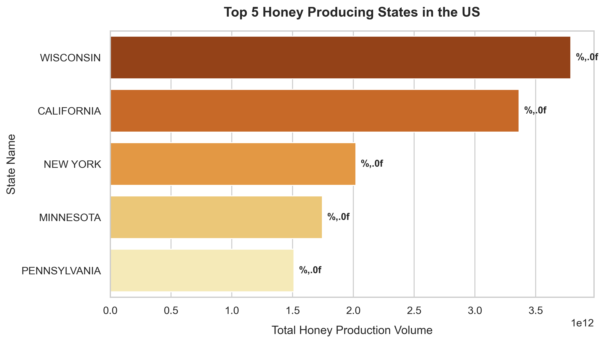
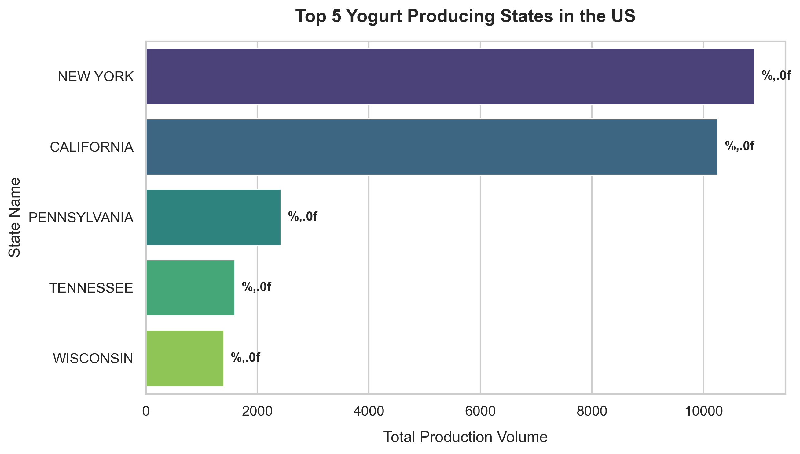
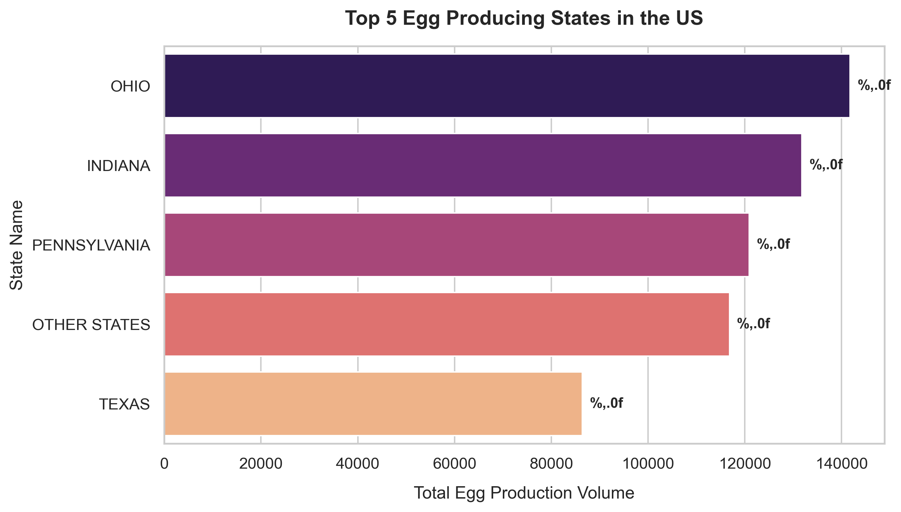

USDA Sales and Production Analysis (SQL & Python)

📌 Project Overview

This project analyzes U.S. agricultural production data (milk, cheese, coffee, honey, and yogurt) using USDA datasets. The objective is to uncover production trends, evaluate top-performing states, identify regional specializations, and generate actionable business insights.

⸻

🎯 Objectives

* Trend Analysis: Analyze production volume patterns across commodities.
* State-Level Performance: Identify top-producing states using ANSI codes.
* Market Segmentation: Compare commodities to detect regional specialization.
* Business Insight: Support supply chain and strategic decision-making.

⸻

🛠 Tools & Technologies

* SQL — Data extraction, aggregation, and transformation
* Python (Pandas, Seaborn, Matplotlib) — Data cleaning, analysis, and visualization
* Jupyter Notebook — End-to-end analysis workflow

⸻


📂 Repository Structure

```text
├── data/
│   └── top_5_milk_producers.csv
├── database/
├── phyton/
├── sql/
├── data_visualization.ipynb
├── data_visualization.png
├── readme.md
├── top_5_egg_chart.png
├── top_5_honey_chart.png
├── top_5_milk_producers.ipynb
└── top_5_yogurt_chart.png
```

## Data Visualization

### 1. Top 5 Milk Producers Chart


### 2. Top 5 Honey Chart


### 3. Top 5 Yogurt Chart


### 4. Top 5 Egg Chart



📊 Data Analysis Workflow

1. SQL Data Extraction

The following query retrieves the top 5 milk-producing states:

SELECT 
    State_ANSI, 
    SUM(production_value) AS Total_Milk_Production
FROM 
    usda_agriculture_data
WHERE 
    product_name = 'Milk'
GROUP BY 
    State_ANSI
ORDER BY 
    Total_Milk_Production DESC
LIMIT 5;

⸻

2. Processed Output (Python Ready)

State	Total Production
Iowa	457B
Pennsylvania	394B
Texas	288B
Ohio	286B
Minnesota	274B

⸻

3. Data Visualization (Python)

The data is visualized using Seaborn to highlight production differences:

import pandas as pd
import seaborn as sns
import matplotlib.pyplot as plt
df = pd.read_csv("data/top_5_milk_producers.csv")
sns.set_theme(style="whitegrid")
sns.barplot(
    x="Total_Milk_Production",
    y="State_Name",
    data=df,
    hue="State_Name",
    palette="Blues_r",
    legend=False
)
plt.title("Top 5 U.S. Milk Producing States")
plt.show()

⸻

📈 Visualization Output

⸻

🔍 Key Insights

* Market Leader: Iowa dominates milk production, significantly outperforming other states.
* High Concentration: Production is concentrated among a small group of states.
* Regional Strength: Midwest states show strong dairy specialization.

⸻

💡 Business Recommendations

* Optimize Logistics: Focus distribution centers near high-production states.
* Risk Diversification: Avoid over-dependence on a single region.
* Strategic Partnerships: Collaborate with top-producing states for supply stability.

⸻

📂 Dataset Information

* Source: USDA Public Datasets
* Commodities: Milk, Cheese, Coffee, Honey, Yogurt

⸻

🚀 Future Improvements

* Build an interactive dashboard using Power BI / Tableau
* Implement time-series forecasting models
* Integrate weather and climate datasets for deeper insights

⸻

👨‍💻 Author

Data Analyst Portfolio Project — SQL & Python
